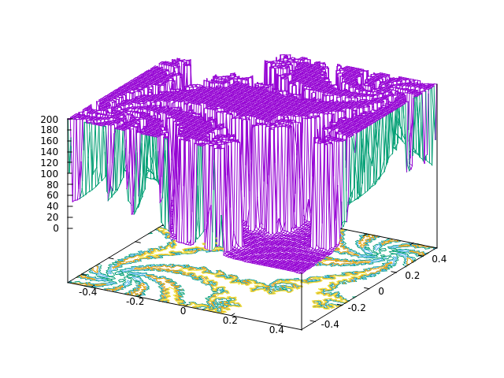
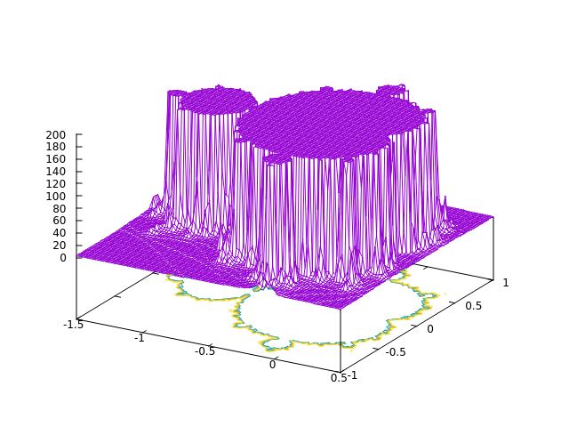

# UNI-Utility-Software

This repository features a diverse range of my solved exercises from the **"Utility Software"** course that I took at University of Wrocław.  

It showcases my proficiency in Bash scripting (basic and advanced), captivating gnuplot scripts and animations (e.g. ECG, Julia set, and Mandelbrot set visualizations), as well as LaTeX practice (presentation and an "research paper" focused on the photoelectric effect).  

Below you can find the two beforementioned fractal sets plotted in gnuplot:  
- [zbior_Julii.gnu - Julia set](https://github.com/tTargiel/UNI-Utility-Software/blob/main/gnuplot/Skrypty/zbior_Julii.gnu)  
  

- [zbior_Mandelbrota.gnu - Mandelbrot set](https://github.com/tTargiel/UNI-Utility-Software/blob/main/gnuplot/Skrypty/zbior_Mandelbrota.gnu)  
  